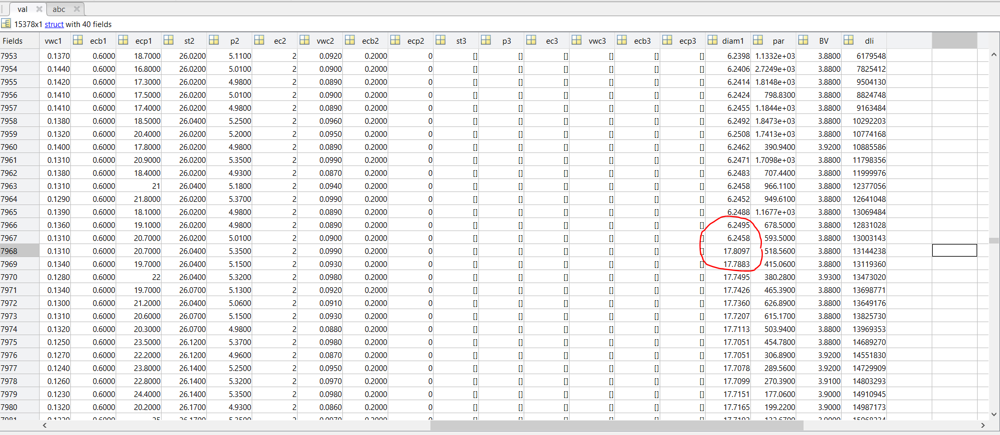

# Time Series Forecasting with Transformers

This repository contains the code and resources for my final year project (TFG) on using Transformer models for time series forecasting. Below, you will find information on the datasets, model training, evaluation, and how to reproduce the results.

## Questions and Considerations

### Datasets
- [ ] Does the model predict based on the first time series in the dataset?
- [ ] Are the MASE metrics calculated with respect to the first time series?
- [ ] If battery voltage is discrete, does the preproscessing changes
- [ ] Is diameter data empty in some datasets and there is a gap in others:

    

### Plot Preparation
- [ ] Prepare plots for visualization.
- [ ] Prepare and preprocess real-world data for the model.
- [ ] Ensure the data is correctly indexed with time for accurate forecasting.
- [ ] Research the use of multigrouper for handling multiple groups in the dataset.
- [ ] Prepare scripts to train the parent models.

### General Questions
- [ ] Why is tabulation used in the report?
- [ ] Why is the bibliography ordered in a certain way? Does the order affect anything?
- [ ] How to properly reference a figure taken from an article?

## Errors and Issues
- [ ] Only the introduction folder is accessible.
- [ ] Only PDF files are accessible.

## Setup Instructions

To set up the environment and run the code, follow these steps:

1. **Install Required Libraries:**
    ```
    pip install gluonts
    pip install datasets
    pip install accelerate
    pip install evaluate
    ```
2. **Mount Google Drive:**
    ```
    from google.colab import drive
    drive.mount('/content/drive')
     ```

3. **Navigate to the Project Directory:**
    ```
    %cd /content/drive/MyDrive/TFG_TST/TFG Code/2_Transformer_Example_Multivariate
    ```
4. **Run the Main Script:**
    ```
    !python main.py
    ```

