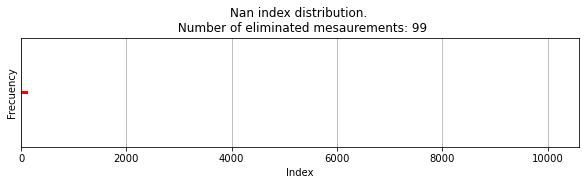

# Time Series Forecasting with Transformers

This repository contains the code and resources for my final year project (TFG) on using Transformer models for time series forecasting. Below, you will find information on the datasets, model training, evaluation, and how to reproduce the results.

## Questions and Considerations

### Datasets
- [ ] Does the model predict based on the first time series in the dataset?
- [ ] Are the MASE metrics calculated with respect to the first time series?
- [ ] If battery voltage is discrete, does the preproscessing changes
- [ ] Is diameter data empty in some datasets and there is a gap in others:
- [ ] I want to show data with the real date index
- [ ] Problems with original dataset

    

    

    

- [ ] Number of Nan values:

    
    
     

### Plot Preparation
- [ ] Prepare plots for visualization.
- [ ] Prepare and preprocess real-world data for the model.
- [ ] Ensure the data is correctly indexed with time for accurate forecasting.
- [ ] Research the use of multigrouper for handling multiple groups in the dataset.
- [ ] Improve orginal dataset plots: Date format T-m-d, and speed, ...
- [ ] Improve the metrics plot..

### General Questions
- [ ] Why is tabulation used in the thesis report?
- [ ] Why is the bibliography ordered in a certain way? Does the order affect anything?
- [ ] How to properly reference a figure taken from an article?

### Ideas
- [ ] Explain about training: GPU, vs CPU
- [ ] Calculate aprox time of training
- [ ] It would be nice to have the frequency calculated from the values of date from csv

## Errors and Issues
- [ ] Only the introduction folder is accessible.
- [ ] Only PDF files are accessible.

### Validation
- [ ] The validation data changes by the prediction lenght

